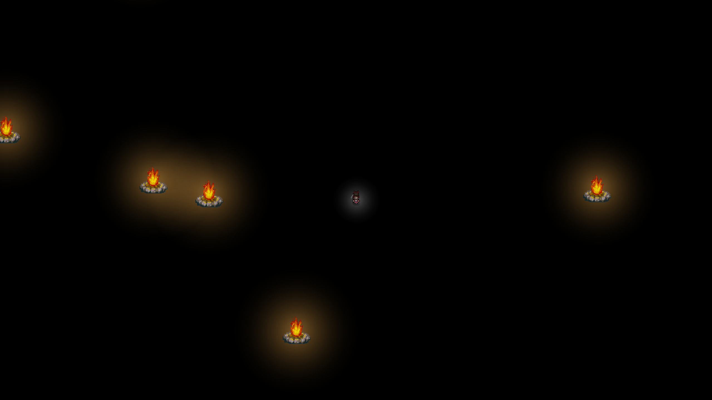
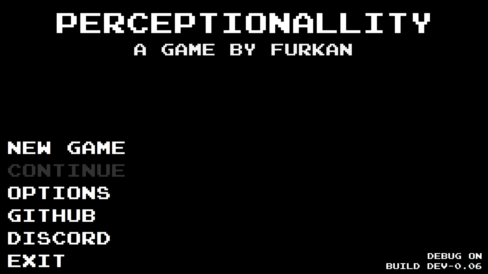

# Perceptionallity

## How to run
Currently there is no compiled executable, you need to compile it yourself.
  
### Debug keys
* F = Show outlines of Components
* R = Reload the last displayed Menu
* H = Toggle camera view (In-Game only)
* G = Reset to Entry Menu
* X = Test Crash
* P = Resume/Pause Game
